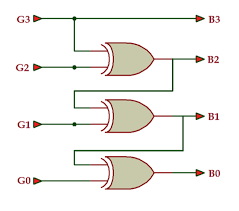
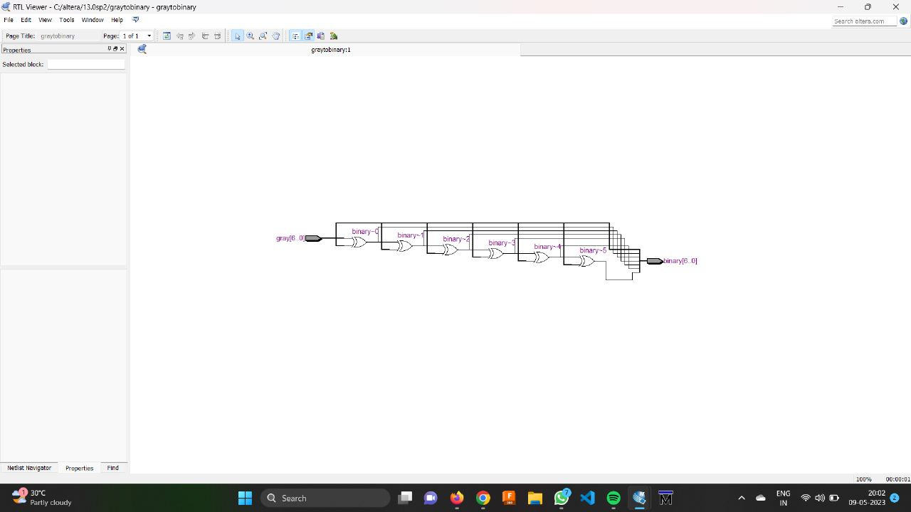
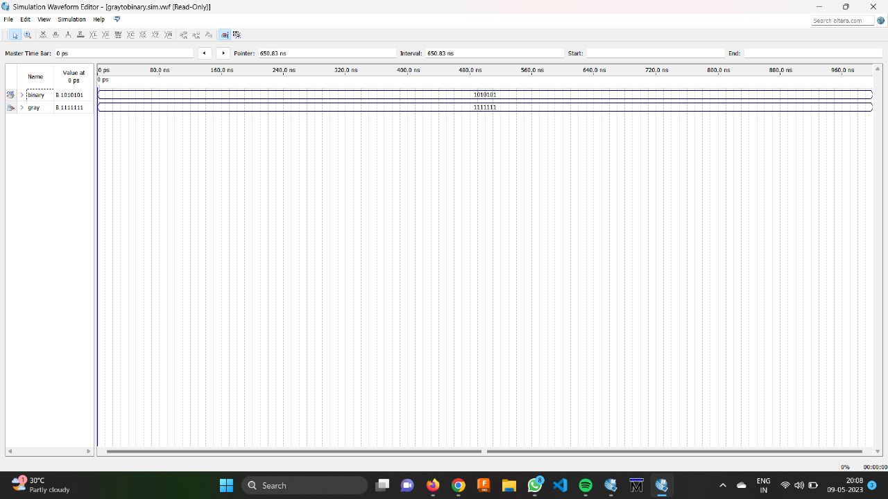

# GRAY TO BINARY CONVERTION USING VERLOG
# AIM
Design and simulate gray to binary converter using Verilog.

# EQUIPMENTS REQUIRED
1.Hardware – PCs, Cyclone II , USB flasher

2.Software – Quartus prime

# THEORY
Gray codes are used in rotary and optical encoders, Karnaugh maps, and error detection. The hamming distance of two neighbours Gray codes is always 1 and also first Gray code and last Gray code also has Hamming distance is always 1, so it is also called Cyclic codes. You can convert a Gray code to Binary number using two methods.

Using Karnaugh (K) - map −

You can construct Gray codes using other methods but they may not be performed in parallel like given above method.

This is very simple method to get Binary number from Gray code. These are following steps for n-bit binary numbers −

Using Exclusive-Or (⊕) operation −

This is very simple method to get Binary number from Gray code. These are following steps for n-bit binary numbers −

1.The Most Significant Bit (MSB) of the binary code is always equal to the MSB of the given binary number. 2.Other bits of the output binary code can be obtained by checking gray code bit at that index. If current gray code bit is 0, then copy previous binary code bit, else copy invert of previous binary code bit.

For example, for 3-bit binary number, let Binary digits are b2 , b1 , b0, where b2 is the most significant bit (MSB) and b0 is the least significant bit (LSB) of Binary. Gray code digits are g2 , g1 , g0, where g2 is the most significant bit (MSB) and g0 is the least significant bit (LSB) of Gray code.
# LOGIC DIAGRAM

# PROCEDURE
1.Create a project with required entities.

2.Create a module along with respective file name.

3.Run the respective programs for the given boolean equations.

4.Run the module and get the respective RTL outputs.

5.Create university program(VWF) for getting timing diagram.

6.Give the respective inputs for timing diagram and obtain the results.
# PROGRAM
Developed by : Arshatha P
Register number : 212222230012
```PY
module graytobinary(
    input [6:0] gray,
    output reg [6:0] binary
);
always @(gray) begin
    binary[6] = gray[6];
    binary[5] = binary[6] ^ gray[6];
    binary[4] = binary[5] ^ gray[5];
    binary[3] = binary[4] ^ gray[4];
    binary[2] = binary[3] ^ gray[3];
    binary[1] = binary[2] ^ gray[2];
    binary[0] = binary[1] ^ gray[1];
end

endmodule
```
# NETLIST DIAGRAM

# TIMING DIAGRAM

# RESULT
Hence gray to binary converter using Verilog has been designed and stimulated.
# REFERENCE
https://youtu.be/fxBEB8i7ToM
